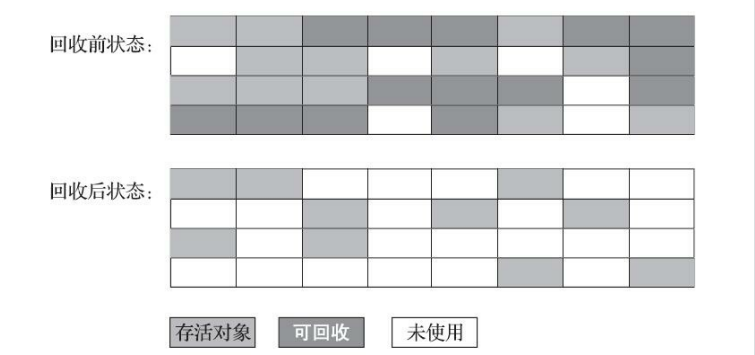
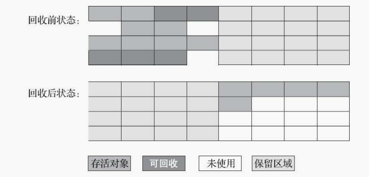

### 第3章 垃圾收集器与内存分配策略

#### 3.1 概述

​	垃圾收集需要完成的三件事情：

* 哪些内存需要回收？
* 什么时候回收？
* 如何回收？

#### 3.2 对象处理

##### 3.2.1 引用计数算法 （Reference Counting）

​	在对象中添加一个引用计数器，每当一个地方引用它时，计数器值加一；当引用失效时，计数器值就减一；任何时刻计数器为零的对象就是不可能再被使用的。

​	引用计数算法原理简单，判定效率也很高，再大多数情况下都是不错的算法。但是在 Java 领域，至少主流的 Java 虚拟机里面都没有选用引用计数算法来管理内存，**主要原因**是：这个看似简单的算法有很多例外情况需要考虑，必须要配合大量的额外处理才能确保正确地工作，譬如单纯的引用计数就很难解决对象之间相互循环引用的问题。

##### 3.2.2 可达性分析算法 （Reachability Analysis）

​	当前主流的商用程序语言的内存观管理子系统，都是通过可达性分析算法来判定对象是否存活的。这个算法的基本思路就是通过一系列称为 “GC Roots” 的根对象作为起始节点集，从这些节点开始，根据引用关系向下搜索，搜索过程所走过的路径称为“引用链”（Reference Chain），如果某个对象到 GC Roots 间没有任何引用链相连，或者说是从GC Roots 到这个对象不可达时，则证明此对象是不可能再被使用的。 


固定可作为 GC Roots 的对象包括以下几种：

* 在虚拟机栈中（栈帧中的本地变量表）引用的对象，譬如各个线程被调用的方法堆栈中使用到的参数、局部变量、临时变量等。
* 在方法区中类静态属性引用的对象，譬如 Java 类的引用类型静态变量。
* 在方法区中常量引用的对象，譬如字符串常量池（String Table）里的引用。
* 在本地方法栈中 JNI（Native）引用的对象。
* Java 虚拟机内部的引用，如基本数据类型对应的 Class 对象，一些常驻的异常对象（NullPointException、OutOfMemoryError）等，还有系统类加载器。
* 所有被同步锁（Synchronized 关键字）持有的对象。
* 反映 Java 虚拟机内部情况的 JMXBean、JVMTI 中注册的回调、本地代码缓存等。

当然，除了这些固定的 GC Roots 集合之外，根据用户所选用的垃圾收集器以及当前回收的内存区域不同，还可以有其他对象“临时性”的加入，共同构成完整的 GC Roots 集合。

##### 3.2.3 再谈引用

​	无论是通过引用计数算法判断对象的引用数量，还是通过可达性分析算法判断对象是否引用链可达，判定对象是否存活都和“引用”离不开关系。

* 强引用（Strongly Reference）：强引用是最传统的引用的定义，指再程序代码之中普遍存在的引用赋值，即类似 Object obj = new Object() 这种引用关系。无论任何情况下，只要强引用关系还存在，垃圾收集器就永远不会回收掉被引用的对象。
* 软引用（Soft Reference）：非必须的对象，只被软引用关联着的对象，在系统将要发生内存溢出异常前，会把这些对象列进回收范围之中进行第二次回收，如果这次回收还没有足够的内存，才会抛出内存溢出异常。在 JDK 1.2 版本之后提供了 SoftReference 类 来实现软引用。
* 弱引用（Weak Reference）：被弱引用关联的对象只能生存到下一次垃圾收集发生为止。当垃圾收集器开始工作，无论当前内存是否足够，都会回收掉只被弱引用关联的对象。在 JDK 1.2 版本之后提供了 WeakReference 类来实现弱引用。
* 虚引用（Phantom Reference）：”幽灵引用“或者”幻影引用“，一个对象是否有虚引用的存在，完全不会对其生存时间构成影响，也无法通过虚引用来取得一个对象实例。为一个对象设置虚引用关联的唯一目的只是为了能在这个对象被收集器回收时收到一个系统通知。在 JDK 1.2 版本之后提供了  PhantomReference 类来实现虚引用。

##### 3.2.5 生存还是死亡？

​	即使在可达性分析算法中判定为不可达的对象，也不是”非死不可“的，这时候他们暂时还处于”缓刑“阶段，要真正宣告一个对象死亡，至少要经历两次标记过程；如果对象在进行可达性分析后发现没有与 GC Roots 相连接的引用链，那它将会被第一次标记，随后进行一次筛选，筛选的条件是此对象是否有必要执行 finalize() 方法。假如对象没有覆盖 finalize() 方法，或者 finalize() 方法已经被虚拟机调用过，那么虚拟机将这两种情况都视为”没有必要执行“。

​	如果这个对象被判定为确有必要执行 finalize() 方法，那么该对象将会放置在一个名为 F-Queue 的队列之中，并在稍后由一条虚拟机自动建立的、低调度优先级的 Finalize 线程去执行它们的 finalize() 方法。这里所说的”执行“是指虚拟机会触发这个方法开始运行，但并不承诺一定会等待它运行结束。这样做的原因是，如果某个对象的finalize()方法执行缓慢，或者更极端地发生了死循环，将很可能导致 F-Queue 队列中的其他对象永久处于等待，甚至导致整个内存回收子系统的崩溃。finalize() 方法是对像逃脱死亡命运的最后一次机会，稍后收集器将对 F-Queue 中的对象进行第二次小规模的标记，如果对象要在 finalize()中成功拯救自己--只要重新与引用链上的任何一个对象建立关联即可，譬如把自己（this关键字）赋值给某个类变量或者对象的成员变量，那么在第二次标记时它将被移出”即将回收“的集合中；如果对象这时候还没有逃脱，那么基本上他就真的要被回收了。


```java
public class FinalizeEscapeGC {

    public static FinalizeEscapeGC SAVE_HOOK = null;

    public void isAlive() {
        System.out.println("yeah！i am still alive!");
    }

    @Override
    protected void finalize() throws Throwable {
        super.finalize();
        System.out.println("finalize method executed");
        FinalizeEscapeGC.SAVE_HOOK = this;
    }

    public static void main(String[] args) throws Throwable {
        SAVE_HOOK = new FinalizeEscapeGC();

        SAVE_HOOK = null;
        System.gc();
        System.out.println("garbage collection is coming :)");

        // finalize() 方法优先级很低
        Thread.sleep(500);

        if (SAVE_HOOK != null) {
            SAVE_HOOK.isAlive();
        } else {
            System.out.println("no,i am dead :(");
        }

        SAVE_HOOK = null;
        System.gc();

        // 此时会被垃圾回收 因为 finalize() 只会执行一次
        Thread.sleep(500);
        if (SAVE_HOOK != null) {
            SAVE_HOOK.isAlive();
        } else {
            System.out.println("no,i am dead :(");
        }
    }
}


// 运行结果
//garbage collection is coming :)
//finalize method executed
//yeah！i am still alive!
//no,i am dead :(
```

​	由运行结果可以看到，SAVE_HOOK 对象的 finalize() 方法确实被垃圾收集器触发过，并且在收集前成功逃脱了。

​	另一个值得注意的地方就是，代码中有两段完全一样的代码片段，执行结果却是一次逃脱成功，一次失败了。这是因为任何一个对象的 finalize() 方法都只会被系统自动调用一次，如果对象面临下一次回收，它的finalize() 方法不会被再次执行，故因此第二段代码的自救行动失败了。

​	还有一点需要特别说明，尽量避免使用finalize() ，finalize() 能做的所有工作，使用 try-finally 或者其他方式都可以做得更好，更及时，请忘掉这个方法。


##### 3.2.5 回收方法区
方法区垃圾回收的”性价比“通常比较低；在Java堆中，尤其是在新生代中，对常规应用进行一次垃圾收集通常可以回收70%至99%的内存空间，相比之下，方法区回收囿于苛刻的条件，其区域垃圾收集的回收成果往往远低于此。

方法区的垃圾收集主要回收两部分内容：
* 废弃的常量
* 不再使用的类型

举例说明：
常量池中字面量回收的例子，假如一个字符串“java”曾经进入常量池中，但是当前系统又没有任何一个字符串对象的值是“java”，已经没有任何字符串对象引用常量池中的“java”常量，且虚拟机中也没有其他地方引用这个字面量。如果在这时发生内存回收，而且垃圾收集器判断确有必要的话，这个“java”常量就将会被系统清理出常量池。常量池中的其他类（接口）、方法、字段的符号引用也与此类似。

判断一个类型是否属于不再被使用的类的条件，需要同时满足三个条件：
* 该类所有的实例都已经被回收，也就是Java堆中不存在该类及其任何派生子类的实例。
* 加载该类的类加载器已经被回收
* 该类对应的 java.lang.Class 对象没有在任何地方被引用，无法在任何地方通过反射访问该类的方法。

Java 虚拟机**被允许**对满足上述三个条件的无用类进行回收。


#### 3.3 垃圾收集算法
* 引用计数式垃圾收集（Reference Counting GC）
* 追踪式垃圾收集（Tracing GC）
从如何判定对象消亡的角度出发，垃圾收集算法可以划分为“引用计数式垃圾收集（Reference Counting GC）”和“追踪式垃圾收集（Tracing GC）”两大类，这两大类也常被称作“直接垃圾收集”和“间接垃圾收集”。

##### 3.3.1 分代收集理论
分代收集理论建立在两个分代假说之上：
1. 弱分代假说（Weak Generational Hypothesis）:绝大多数对象都是朝生夕灭的。
2. 强分代假说（Strong Generational Hypothesis）：熬过越多次垃圾收集过程的对象就越难以消亡。
两个分代假说共同奠定了多款常用的垃圾收集器的一致的设计原则

* 收集器将Java堆划分不同的区域
* 将回收对象依据年龄分配到不同的区域之中存储

显而易见，如果一个区域中大多数对象都是朝生夕灭，难以熬过垃圾收集过程的话，那么把他们集中放在一起，**每次回收时只关注如何保留少量存活而不是去标记那些大量将要被回收的对象**，就能以较低代价回收到大量的空间；如果剩下的都是难以消亡的对象，那么把他们集中放在一块，虚拟机便可以使用较低的频率来回收这个区域，这就同时兼顾了垃圾收集的时间开销和内存的空间有效利用。
在 Java 堆划分出不同的区域之后，垃圾收集器才可以每次只回收其中某一个或者某些部分的区域
==回收类型划分==
* Minor GC
* Major GC 
* Full GC

==垃圾收集算法==
* 标记-复制算法
* 标记-清除算法
* 标记整理-算法

3. 跨代引用假说（Intergenerational Reference Hypothesis）:跨代引用相对于同代引用来说仅占极少数。
存在互相引用关系的两个对象，是应该倾向于同时生存或者同时消亡的。

* 部分收集（Partial GC）:指目标不是完整收集整个Java堆的垃圾收集，其中又分为：
  * 新生代收集（Minor GC/Young GC）：指目标只是新生代的垃圾收集。
  * 老年代收集（Major GC/Old GC）:指目标只是老年代的垃圾收集。
  * 混合收集（Mixed GC）：指目标是收集整个新生代以及部分老年代的垃圾收集。（目前只有G1收集器会有这种行为）
* 整堆收集（Full GC）:收集整个 Java 堆和方法区的垃圾收集。


##### 3.3.2 标记-清除算法 （Mark-Sweep）
算法分为“标记”和“清除”两个阶段
1. 首先标记需要回收的对象（或者标记存活的对象，统一回收苏所有未被标记的对象）
2. 统一回收掉所有被标记的对象

主要缺点：
1. 执行效率不稳定，标记和清除两个过程的执行效率都随着对象的增长而降低
2. 内存空间的碎片化问题，标记、清除之后会产生大量不连续的内存碎片(空间碎片太多可能会导致当以后在程序运行过程中需要分配较大对象时无法找到足够的连续内存而不得不提前触发另一次垃圾收集动作)


##### 3.3.3 标记-复制算法
标记-复制算法常被简称为复制算法.
1. 将可用内存按容量划分为大小相等的两块,每次只使用其中的一块
2. 当这一块的内存用完了,就将还存活着的对象复制到另外一块上面
3. 然后再把已使用过的内存空间一次清理掉

缺陷:
复制回收算法的代价是将可用内存缩小为原来的一半,空间浪费太多了.



##### 3.3.4 标记-整理算法(Mark-Compact)


