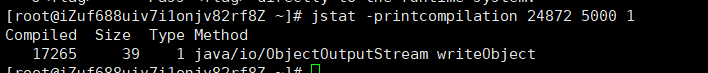

### 第4章 虚拟机性能监控和故障处理工具

#### 4.1 概述

#### 4.2 基础故障处理工具

##### 4.2.1 jps:虚拟机进程状况工具
jps （JVM Process Status Tool）
jps [options] [hostid]

| options | application |
| ----    | ----        |
| -q      | 只输出LVMID,省略主类的名称 |
| -m      | 输出虚拟机进行启动时传递给主类的 main() 函数的参数 |
| -l      | 输出主类的全名，如果进程执行的是 JAR 包，则输出 JAR 路径 |
| -v      | 输出虚拟机进程启动时的 JVM 参数 |

##### 4.2.2 jstat:虚拟机统计信息监视工具
jstat(JVM Statistics Monitoring Tool) 是用于监视虚拟机各种运行状态信息的命令行工具。
可以显示本地或者远程虚拟机进程中的类加载、内存、垃圾收集、即使编译等运行时数据
jstat [option vmid [interval[s|ms][count]]]
VMID与LVMID 说明：
如果是本地虚拟机进程，VMID与LVMID是一致的；如果是远程虚拟机进程，那VMID的格式应当是：[protocol:][//] lvmid [@hostname[:port]/servername]
参数 interval 和 count 代表查阅间隔和次数，如果省略这2个参数，说明只查询一次。
选项option代表用户希望查询的虚拟机信息，主要分三类：
* 类加载    -class

* 垃圾收集  -gc
  * -gccapacity 监视内容与-gc基本相同，但输出主要关注 Java 堆各个区域使用到最大、最小空间
  
  * -gcutil 监视内容与-gc基本相同，但输出主要关注已使用空间占总空间的百分比

  * -gccause 与-gcutil 功能一样，但是会额外输出导致上一次垃圾收集产生的原因
  
  * -gcnew 监视新生代垃圾收集状况
  
  * -gcnercapacity 监视内容与-gcnew基本相同，输出主要关注使用到的最大、最小空间
  * -gcold  监视老年代垃圾收集状况
  
  * -gcoldcapacity 监视内容与-gcold内同相同，输出主要关注使用到的最大、最小空间。
  
  * -gcpermcapacity 输出永久代使用到最大、最小空间。
  * -gcmetacapacity 输出元空间使用到最大、最小空间
  
* 运行期编译状况    -compiler 输出即使编译器编译过的方法、耗时等信息

* -printcompilation 输出已经被即使编译的方法

